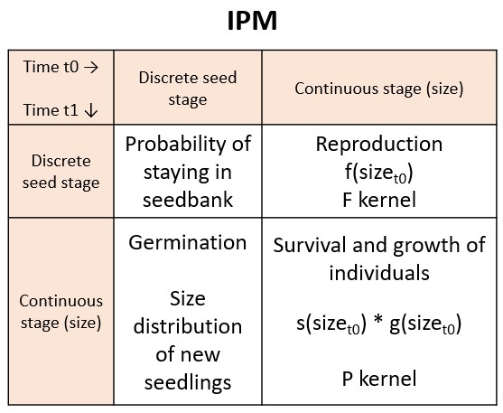

# General Workflow {#genwf}

In the RUPDemo project, we will digitize IPMs from published studies, and directly from raw data. In the first scenario, you will recreate IPMs exactly how they are published in order to reproduce the exact same results from the paper, with the only difference being that you will reformat the model to be included within the PADRINO database. In the second scenario, you will completely parameterize an IPM from scratch based on a published dataset that lacks an IPM. Most of the "easiest" publications of the first type have already been added to PADRINO, leaving much more complicated datasets for us to work with. Most of these fall somewhere between the two types of digitization tasks, involving extensive data preparation and parameterization of vital rate models based on limited information reported in the publication. 

At the beginning of the RUPDemo project, we will all start with a collection of chart quadrat data that includes "the Adler dataset" and other similar datasets. Working with these datasets requires preparation of spatial data collected from chart quadrats and then complete parameterization of IPMs from scratch. Fortunately, I have already started digitizing some of the models from this collection and can supply a roadmap of the specific workflow for working with these data, which is found in Chapter \@ref(adwf). In the sections to follow, however, I will focus on outlining a more general workflow that can apply to pretty much any future RUPDemo digitization projects.

This guide aims to amend what is currently missing from [the official PADRINO digitization guide](https://padrinodb.github.io/Padrino/index.html). Please refer to both of these guides in tandem to answer your questions; sections below which seem a little sparse are likely well-detailed in the official PADRINO guide.

## Incoming candidates for digitization

One aspect of the RUPDemo project is to identify datasets and publications that should be included in PADRINO. As a collaborative group, we all work to keep track of new IPMs coming in the literature. Roberto Salguero-Gomez (U. of Oxford) keeps track of the literature, and posts new articles containing IPMs in the PADRINO slack channel. The Leipzig team is in charge of reading up on posted literature and deciding if the article should be digitized or not. If it should be digitized, then it should be added to the [the "Incoming literature" Google Sheet](https://docs.google.com/spreadsheets/d/1jZbnlrOndybRfLTU1aKfxcQe60O8gSqBDoPiE5SFlrA/edit?usp=sharing).

Be sure to check the slack channel at least once a month, as messages are lost after 90 days. Publications posted in the slack channel may not actually be eligible for inclusion in PADRINO (usually because they do not have IPMs, or sometimes because they use MPMs instead). Be sure to reply to the message when you've checked a publication and let everyone know that it has been added to the Sheet, or otherwise tell us why it shouldn't be added to the Sheet.

You may come also across candidate publications "organically" while reading. If it seems like it may qualify for addition to PADRINO, go ahead and add it to the Sheet; no need to post about it on slack. If you're unsure about whether a publication should be included, feel free to just ask me (or Aldo).

## Selecting a new project

After we finish with the Adler dataset, you might have the opportunity to pick what you will work on next. Within the scope of the RUPDemo project, we have some criteria to help you select your next project. Open up the Incoming literature Google Sheet (linked above) and explore your options according to these criteria:

- Kingdom: only "Plantae"    
    We are only interested in digitizing IPMs for plants in the RUPDemo project.

- Digitized: only "N"  
    Filter out any publications which have already been digitized or are in progress. 

- Density dependence?: deselect "YES"  
    For now, we will only focus on IPMs which do not account for density dependence. Please note that not all publications have been screened for density dependence, so you may come across some IPMs which do account for density dependence despite missing the "YES" in the density dependence column. If this is the case, please update the Sheet accordingly.

- Remark
  Take note of any comments from myself or other past digitizers about why this publication can not or should not be digitized, or essential information that is missing from the publication that currently prevents digitization.

- Length of study: ideally 10 transitions at minimum
  You will quickly notice that there are very few datasets with enough transitions at this point. Studies with adequate transitions have major roadblocks that prevent digitization, and the easiest models are built from very few transitions. You will likely need to choose to email the authors of one of the roadblocked datasets to ask for the missing information, and then hope they reply in a timely manner.
  
If you cannot find anything to work on, ask me or Aldo and we can help you find something to tackle next.

Once you have selected the publication you will work on next, be sure to update the "Digitized" column with "in progress" and add your initials to the "Digitizer" column to let everyone know that you're working on it. If you've sent an email to the authors, then please put "Email" in the "Digitized" column. When you have finished digitizing, put "Y" in the "Digitized" column and celebrate your success!

## Supply list

Before you begin a digitization project, be sure you have all of the following supplies ready:

  - Notebook to sketch out the IPM
  - Microsoft Excel 
  - The following R packages:
    + `ggplot2`
    + `tidyverse`
    + `patchwork`
    + `lme4`
    + `readxl`
    + `ipmr`
    + `Rpadrino`
    + `pdbDigitUtils`
    + `testthat`


## General workflow outline

More information on these steps are provided in the following chapters, or in the official PADRINO digitization guide linked previously. The PADRINO digitization guide has more detailed information about reformatting models for PADRINO, including explanations of each of the tables which need to be populated in the PADRINO database template Excel sheet. This guide focuses more on the workflow leading up to the final step of digitization (populating the database template).

The script naming conventions used below are flexible and serve as an example of how many scripts you might need to produce for more complex digitization tasks. Simpler tasks where all parameter values are reported in the text may be digitized in only two scripts.

### 1. Read the publication

Download a PDF of the article and track down all of the supplements and/or appendices (only download as necessary). Read the article, focusing mostly on the Materials & Methods section; you can generally skim the other sections but be sure you are familiar with the whole text. Examine the supplements/appendices/supporting data and familiarize yourself with the information that is present, and think about what might be missing or what you might need to model. Start collecting the information that will go in the Metadata sheet of the PADRINO database template.

### 2. Sketch an outline of the IPM

I find that it is helpful to draw a diagram of the different components of the IPM to identify which vital rates are modeled and how they fit into the kernels. At this stage, you can start to see which parameters you will need to track down or model and what types of models you will need to fit. Here is an example of an IPM sketch:
```{r echo=FALSE, message=FALSE, warning=FALSE, fig.align = 'center', fig.width=6 }

```

In this model, the population consists of two stages: a continuous stage based on size which describes seedlings and adults, and a discrete stage describing the seedbank. The IPM for this population will include the P kernel describing the survival and growth of seedlings and adults, the F kernel describing the reproduction of adults (addition of seeds to the seedbank), a probability of a seed remaining in the seedbank, and a probability of germination of a seed out of the seedbank and into the continuous size class following a size distribution of new seedlings. In the sketch, we visualize all transition possibilities and consider which transitions are impossible (represented by zeros), which transitions are described by constants (discrete to discrete: probability of staying in the seedbank), which transitions are dependent on the continuous stage (continuous to continuous, e.g. survival and growth, or continuous to discrete, e.g. reproduction), and which transitions include size distributions (continuous to continuous, e.g. growth, or discrete to continuous, e.g. germination). Not all IPMs will include both continuous and discrete stages; simple IPMs only have a single continuous stage describing all transitions. Take the time to carefully consider all of the data you have to work with, and all of the possible transitions described by those data.

Additionally, this is the stage to identify how many IPMs are actually included in the dataset and how they are related to one another, which can inform how you will organize your scripts & subfolders and how many IPM IDs you will need to differentiate your models in the PADRINO database. We will assign a series of IPM IDs to you that you will pull from.

Please contact us before moving on. I generally like to do this step together with Aldo; if you'd like to see how far you can get on your own first, that is perfectly fine, but these models are complex and often it takes more than one brain to ensure that everything is accounted for. 

### 3. List the equations and parameters needed to recreate the IPM

Once you feel like you've got a handle on how the IPM is put together, comb the text of the article to find out how all of the vital rates have been modeled. Write down the model expressions as they are presented in the text, and then consult [Sam's guide to Model expressions](https://github.com/padrinoDB/Padrino/blob/b797159d64283fa5ac88b79841544faf14a5aa98/metadata/digitization/pdb_expr_guide.pdf) to rewrite the expressions in the correct format for ipmr. In this step, I like to create a "shopping list" of all of the parameters I will need to track down or model in order to fully recreate the IPM as published. This is also the step where you will identify if you will use suffixes in your parameters.

### 4. Take inventory

Based on your "shopping list," do you have all of the materials necessary to recreate the IPM? Identify where in the main text, supplements, appendices, and/or supporting data you will be able to find the information you need to construct each part of the IPM. Don't just assume you'll find it along the way!

If you're very lucky, the publication will actually report all vital rate model expressions, parameter values, and all of the necessary information you need to build each kernel. In this case, digitization can occur in a single R script (see steps 6 & 11 and the digitization guide).

In many cases, however, you will only have model expressions and raw data to build from. The steps 5 through 10 apply to these digitization projects.

In some cases, you might find that only a few parameters are missing. This will require an email to the corresponding author from the PADRINO email (more information [here](https://github.com/padrinoDB/Padrino/blob/main/metadata/digitization/author_contact_pdb.Rmd)). Be sure to take notes about what exactly is missing and note this in the Google Sheet so someone else doesn't waste their time coming to the same conclusion you just did!

### 5. Create a new R project

Once you know you have everything you need, create a new R project in your folder. Consult Chapter \@ref(projorg) for more details about structuring and organizing your project. In general, the project should be named according to the first author and the year of publication.

### 6. Script: 01_DataFormatting.R

This first step of digitization can refer to either formatting the parameter values directly from the text before moving onto populating the database template (step 11), or formatting the raw data you've downloaded to prepare for model fitting (step 7). If the "raw" data you're working with are actually the parameter estimates directly downloaded from the publication, then this step just involves putting the parameter estimates into their own dataframe with appropriate names for the vital rate models. In most cases, though, you will likely be working with actual raw data that needs to be cleaned up or reformatted. Follow what is written in the publication methods to make sure you are creating the subsets of data exactly as reported. The output of this script should be a couple of subsetted dataframes that are ready to be fit with linear models which describe the vital rates.

This is also when you should start documenting any decisions you (or we) make about the dataset. Do you filter out any data? Why? Create a text document (Notepad, Word, R, etc.) and note down how you have filtered the data with justification for why. Store this document in the project home folder with a descriptive title, i.e. "Author_year_notes.txt" or "README.txt".

### 7. Script: 02_PlotRawData.R

In this script, you will plot the raw data that will be described by the vital rate models to check for any peculiarities in the data. Examples of what variables to plot include size_t1 ~ size_t0, survives_t1 ~ size_t0. Additionally, examine histograms of each variable. You should plot the data at multiple scales, including the smallest scale possible, i.e. one plot for each transition x treatment combination, and aggregated across all treatments or years. These plots should help you identify the distributions of the data as well as any individual datapoints that should be filtered out before model fitting. Be sure to document any further filtering that happens at this stage in the "notes" / "README" file.

### 8. Script: 03_VitalRateModels.R

The next step is to fit linear models to the data to describe the vital rates. In some instances, it may not be clear exactly how the model should be fit; in this case, you may need to write multiple versions of the models and compare the AIC values of the different models to select the model with the best fit. Always plot your model results against data. This is relatively easy using the `predict( )` function.

In this stage, you might notice more peculiarities with the data that make it difficult to fit the model you might reasonably expect to use. Some models might do very well at predicting the entire dataset, but perform poorly at predicting within the different treatments/years/etc. Aldo will have suggestions for selecting the best model, which may include data transformations. 

Once you have selected the best fitting models for all of the vital rates, store all of the model parameters in the data folder as csv files. This will generally be four different files: one each for growth, survival, recruitment/reproduction, and "other," which will include things like min and max sizes for the different kernels. It is useful to keep the different vital rates separate at this stage in case you need to go back to this script and make changes to only a single model. Again, document any data transformations, filtering/subsetting decisions, etc. in your notes document.

### 9. Script: 04_IPMScratch.R

Finally it is time to construct the first IPM! In this script, you will build the IPM "from scratch," writing functions to describe all of the vital rates and their link functions and then piecing them together in the kernel function.

The first step is to put all of the vital rate parameters together into a list, where each list item is a named parameter value. Then, you will write all of the vital rate models as functions of x, y, and the input parameters (pars). Specific examples of how to write these functions will be provided in other documents. In general, you will need functions describing at least the following processes:

  - standard deviation of growth, `grow_sd( x, pars )`

  - growth from size `x` to size `y`, `gxy( x, y, pars )`, which will return a probability density distribution describing growth for each `x` size class

  - survival at size `x`, `sx( x, pars )`, which will describe the survival probability of each `x` size class

  - the combined transition of survival * growth, `pxy( x, y, pars )`, which describes the P kernel, `sx * gxy`

  - some sort of recruitment function(s), which may include size-dependent production of recruits `fx( x, pars )` to describe the number of recruits produced by mothers of size `x`, then a size distribution of recruits `recr( y, pars )` to return a probability density distribution describing the size of each recruit, and a function linking these together as `fxy( x, y, pars )` constructed as `fx * recr`; or size-independent production of recruits (each mother produces the same number of recruits, recruitment is based on number of individuals in year t0), which is just a function of `fy( y, pars )`, returning a probability density distribution describing the size of new recruits

More complex models may have additional function inputs, and these models do not necessarily describe all possible models you may need to write. Examples of how to structure these models will be provided as you are working, depending on what types of models you will work with.

Once all of your vital rate functions are ready, you will then construct the function which generates the IPM kernel/matrix. The function should first define the domain of the IPM, which will stay the same across most models:

```
n   <- pars$mat_siz                        # number of bins over which to 
                                                # integrate
L   <- pars$L                              # lower limit of integration
U   <- pars$U                              # upper limit of integration
h   <- ( U - L ) / n                       # bin size
b   <- L + c( 0:n ) * h                    # lower boundaries of bins 
y   <- 0.5 * ( b[1:n] + b[2:( n + 1 )] )   # midpoints of bins
                                              # b are boundary points, 
                                                # y are mesh points
```

The next part of the kernel function should assemble the kernel matrices. Consult back to step 2 where you sketched out the IPM kernel to determine how many matrices and vectors you will need to assemble from the vital rate functions. Most IPMs will need an F matrix describing recruitment/fertility, and a T matrix describing yearly transitions of individuals, which is composed of the survival and growth matrices. You may also need to define a number of vectors which describe transitions in and out of discrete stages like a seed bank. Additionally, this section of the kernel function should correct for eviction, if necessary.
  
The last part of the kernel function should put all of the matrices together which will look like `k_yx <-  Tmat + Fmat` in the case of the simplest model. End the function so that it returns all of the component matrices you might be interested in examining, in addition to the `k_yx` matrix. Finally, run your kernel function with the (mean) parameter values, and calculate the (mean) population growth rate, lambda:
```
lambda <- Re( eigen( kernel( pars )$k_yx )$value[1] )
```
If you're working with a dataset that has a reported value for lambda, the population growth rate, compare the calculated lambda value(s) to the reported lambda value(s). If the results of the IPM seem unrealistic or very different from the reported lambda, you will need to troubleshoot before moving forward. This generally involves going back to the vital rate models to test out different data transformations or model formulas, but sometimes you might need to go all the way back to the data formatting step to make changes to the subsets of data you're working with. If you're parameterizing the IPM completely from scratch, then you will need to compare the calculated lambdas to the population numbers throughout the study period to check if the IPM is producing reasonable results.

Depending on your dataset, you might also need to parameterize the IPM for a number of treatment levels or different years. Examples of how to approach this task will be provided as necessary. Describe your approach in the notes document.

### 10. Script: 05_ipmr.R

Once you are confident that your from-scratch IPM is working correctly, you need to test that the IPM can be successfully recreated using the ipmr package and syntax, which is the underlying process powering PADRINO. There is a lot of helpful information which can be found on [the ipmr site](https://padrinodb.github.io/ipmr/).
  
Use the `init_ipm( )` function in ipmr to start building your proto IPM, one kernel at a time. Reference the ipmr site and example scripts we provide to make sure you're not forgetting any component. Start with only one kernel and the supplementary components to test to make sure each kernel is working independently before combining them.

After defining each kernel, the `init_ipm( )` function needs three more pieces to run:
  
  - `define_impl( )`: define the implementation for each kernel  
  This should be a list of lists, with the number of lists equal to the number of kernels and each nested list consisting of four components:

    + `kernel_name`: name of the kernel (ex. `"P"`, `"F"`, `"SB_to_plant"`)
    + `int_rule`: for now, this will always be `"midpoint"`
    + `state_start`: what is the name of the input variable for this kernel?
    + `state_end`: what is the name of the output variable for this kernel?  
  
    For simple IPMs, `state_start` and `state_end` will be the same variable which describes the continuous size class. For general IPMs, `state_start` and `state_end` are the same for the P and F kernels, as in simple IPMs, but they will be different for the kernels which describe transitions to and out of discrete states. For example, a kernel describing the size-dependent production of seeds going into a seedbank would have `state_start = "size"` and `state_end = "seedbank"` and the kernel describing the germination of seeds out of the seedbank and into the continuous size class would have `state_start = "seedbank"` and `state_end = "size".` 

  - `define_domains( )`: define the continuous domain(s)  
  In this function, you need to tell ipmr all about the continuous state(s) that will be integrated. Each continuous state should have three values looking something like this:
    ```    
size = c( pars$L,         # lower bound of the domain
          pars$U,         # upper bound of the domain
          pars$mat_siz )  # number of meshpoints for the domain
```
  - `define_pop_state( )`: define the initial state of the population  
  Because ipmr computes everything through simulation, we must define a starting population vector that can be simulated from. All domains, both continuous AND discrete, need to have starting states. The below example describes a general IPM with a continuous domain describing size and a discrete domain describing a seedbank:
    ```
define_pop_state(
      pop_vectors = list( 
            n_size      = rep( 1 / pars$mat_siz, pars$mat_siz ),
            n_seedbank  = 1 / pars$mat_siz ) )
```
   For simple IPMs with only a single continuous domain, n_size does not need to be contained in the pop_vectors list. It is essential that the `n_` prefix is attached before the name of the variable describing the domain; make sure everything matches!

Once all components of the proto IPM have been piped together in the `init_ipm( )` function, you can then make the IPM and generate the lambda:
```
make_ipm( name_of_proto_ipm, iterations = pars$mat_siz ) %>% lambda( )
```

At this point, you might need to test the proto IPM for each treatment or year. Consult the example scripts or ask for help to write functions that will calculate the lambdas for each treatment/year/etc. Export these lambda values in a csv dataframe. Be sure to also export the parameter values which vary between years/treatments/etc., using an underscore to separate the name of the parameter and the specific year/treatment/etc. the parameter applies to. You should have three csv files in the end: parameter values which stay constant across all years/treatments/etc., parameter values which vary, and lambdas for each year/treatment/etc. Simpler datasets will only have a single csv output which describes all parameter values AND the lambda value.

### 11. Script: 06_PADRINO.R

Now that you know the IPM can be recreated with the ipmr syntax, it is time to prepare the model to be included in PADRINO! Load all of the csvs which contain parameter values and lambdas for testing. Additionally, read in the Excel file of the PADRINO database template (replace the ... with the path to wherever you're storing the file!):
```
sheet_names <- excel_sheets(".../pdb_template.xlsx")
pdb <- lapply(sheet_names, function(x) {
  as.data.frame(read_excel(".../pdb_template.xlsx", sheet = x)) } )
names(pdb) <- sheet_names
```
Now, you can start populating each sheet of the template using common indexing syntax to access each sheet, such as `pdb$Metadata[i,j]`. This is also a good stage to write some functions to fill in all of the information for multiple IPM IDs, if you need to. Consult the PADRINO digitization guide for more details about which things go where:
  
  <https://padrinodb.github.io/Padrino/digitization-guide.html#the-tables>

The `pdb$VitalRateExpr` sheet will likely be the most complicated. Check the examples often. The majority of the issues arise from inconsistencies in naming the different parameters, kernels, and vital rate expressions. If you capitalize the name of the parameter in the vital rate expression, be sure to also capitalize the name in the `pdb$ParameterValues` sheet!!!

Once all of the information for every model is entered into the spreadsheet, export the file to Excel and test each IPM ID:
```
write_xlsx( pdb,"pdb_Author_year.xlsx" )

pdb_test    <- read_pdb( "pdb_Author_year.xlsx" )
ipm_ids     <- pdb_test$Metadata$ipm_id
output      <- c( )
test_ipms   <- function( i ){
  output[i]  <- capture.output( test_model( pdb_test, ipm_ids[x] ) )
  return( output )
}
lapply( 1:length( ipm_ids ), test_ipms )

# replace IPM_ID below with a single ID to look at one IPM at a time
pdb_test_proto <- pdb_make_proto_ipm( pdb_test, det_stoch = "det" )
print( pdb_test_proto$IPM_ID ) 
test_ipm       <- make_ipm( pdb_test_proto$IPM_ID )
test_ipm
lambda( test_ipm, type_lambda="all" )
test_model( pdb_test,id = "IPM_ID")
```
In all likelihood, your IPM(s) won't work. You will get some sort of cryptic error message that really doesn't tell you what went wrong and you won't have any idea where to begin troubleshooting. My biggest piece of advice for this step is to seriously take your time when populating the Excel sheet. It is very tempting to think that the hard part is over, the IPM works, now you just need to plug in some numbers into a spreadsheet, you're so close to finishing this model! and then you rush through this step and the model fails to run from the Excel file and it is super frustrating. Nearly always, there is nothing actually wrong with the model. Some combination of two things has most likely happened: there is at least one typo or inconsistency in how you call the parameters/vital rates/kernels, and/or there is an issue with how some of the data are written into the Excel sheet OR read from the Excel sheet.

The first thing to do when your model doesn't run is to take a break. Have a coffee, step away from the screen, do something else for at least five minutes. Remind yourself that the hardest part IS done, the model DOES run, and you WILL find the problem. The next thing to do is to open the Excel file that contains the model and take a look at it in Excel. Browse through all of the sheets and look for anything that may have been exported wrong.

Sometimes, it is as simple as your indexing was `[j,i]` when it was supposed to be `[i,j]`, so one of the sheets is weirdly transposed. Maybe some of the columns don't actually align correctly because the F kernel was repeated twice when it was supposed to be repeated three times. Problems like these are easy to fix in the script; re-export the Excel file and test it again.

If all of the cells seem to be filled in the right configuration, the next thing to check is consistency in calling all of the parameters, vital rates, and kernels. Check the StateVariables, ContinuousDomains, IntegrationRules, StateVectors, IpmKernels, VitalRateExpr, ParameterValues, EnvironmentalVariables, and ParSetIndices sheets and make sure every name is consistent in spelling and capitalization. I often find that I catch a ton of little errors like this. While it is frustrating, these are also easy to fix and test again.

Once you are absolutely certain that every cell contains the correct info, if the IPM still doesn't work, it may be an issue with how the data are encoded. Think about how Excel is truly terrible at formatting dates: sometimes, numbers get interpreted as dates when they are absolutely not, or conversely, dates get interpreted as impossible points in time. Convincing Excel to interpret these values correctly is not always easy. I've come up with a number of columns that may get encoded or interpreted incorrectly, which can be bypassed by running these lines of code after you have loaded the Excel model, but before you begin the testing:
``` 
pdb_test$Metadata$eviction_used  <- as.logical( pdb_test$Metadata$eviction_used )
pdb_test$ContinuousDomains$lower <- as.numeric( pdb_test$ContinuousDomains$lower )
pdb_test$ContinuousDomains$upper <- as.numeric( pdb_test$ContinuousDomains$upper )
pdb_test$StateVectors$n_bins     <- as.numeric( pdb_test$StateVectors$n_bins )
pdb_test$ParameterValues$parameter_value <- as.numeric( pdb_test$ParameterValues$parameter_value )
pdb_test$TestTargets$precision   <- as.numeric( pdb_test$TestTargets$precision )
```
You might need to perform similar actions on other columns if these still don't fix the issue.

If after performing all of these checks the model still won't run, ask for help. A second set of eyes might be able to pick out an error you missed, or maybe Aldo actually knows what the ipmr error message is referring to!

Eventually, you will get the model(s) performing correctly and you can move on to the final step!

### 12. Final steps of digitization

- Store the completely populated PADRINO database Excel file in the project home folder.

- Update the notes file to make sure all of the decisions you made about the data and changes you made to the dataset are described in a reproducible way.

- Write a "wrapper" file which describes the project. This file should also be stored in the project home folder. The name of the wrapper file should be something like "ProjectName_overview.R" or "ProjectName_wrapper.R". The wrapper file should include an introduction that describes the dataset (which species, when were the data collected, where were the data collected, and a full citation of the publication) and the purpose of the project (to recreate the published IPM for inclusion in the PADRINO database). Then, all of the scripts should be listed in the order in which they should be executed, with minimal description of the steps only if they are necessary. Briefly describe any other files contained within the project that have not been already mentioned. Take this time to also reorganize any other files that may have ended up in the project. If you produced multiple versions of any file for testing, create a new folder called 'temp' and store the extras in there.

  Essentially, the whole point of the wrapper file is to communicate to an outside person exactly what you did so that they could open any of the files in the project and know what they're looking at. This is useful for yourself to revisit older projects in reference to starting new projects, but it is also essential to the entire team. PADRINO is a work in progress and we have lots of goals to improve the database. Some of these goals involve adding other components to the digitization process, so it would be incredibly helpful to be able to know exactly what you did in case we need to add to your projects in the future.

  Creating the wrapper file is not necessarily a step that must be saved until you've completed a project. You are of course free to create the wrapper at any stage of the project, especially if it helps you keep everything organized! I find that it is particularly helpful to already have a wrapper in progress if I know I am going to put a project aside for a few weeks to help me get back into the workflow.

- Make sure all of the files are organized, uploaded, and synced to whatever cloud service we've decided to use.

- Update the "Digitized" column in the Incoming literature Google Sheet to "Y" and let us know it is time to celebrate!


## Why do we construct the IPM twice?

At this point, you might be asking "Why did I write the IPM from scratch if I actually needed to write it using ipmr for PADRINO?" and the answer is that troubleshooting in the PADRINO format is much harder to do. Writing the IPM from scratch first gives you the ability to go back and troubleshoot exactly the part of these complex models that is causing an issue. In the PADRINO format, even identifying the part of the model that is "wrong" is very challenging and unintuitive. Therefore, constructing the IPM from scratch gives us more opportunities to catch and correct mistakes.


## Useful links

I recommend that you make a folder in the bookmarks bar of your preferred web browser and bookmark all of these for easy access:

- [PADRINO digitization guide](https://padrinodb.github.io/Padrino/index.html)

  Jump to the section that explains each table in the template [here](https://padrinodb.github.io/Padrino/digitization-guide.html#the-tables)

- [Incoming literature Google sheet](https://docs.google.com/spreadsheets/d/1jZbnlrOndybRfLTU1aKfxcQe60O8gSqBDoPiE5SFlrA/edit?usp=sharing)

- [Sam's guide to writing model expressions in ipmr](https://github.com/padrinoDB/Padrino/blob/b797159d64283fa5ac88b79841544faf14a5aa98/metadata/digitization/pdb_expr_guide.pdf)

- [Tons of info about ipmr](https://padrinodb.github.io/ipmr/)
  
  